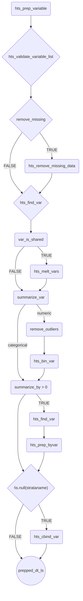
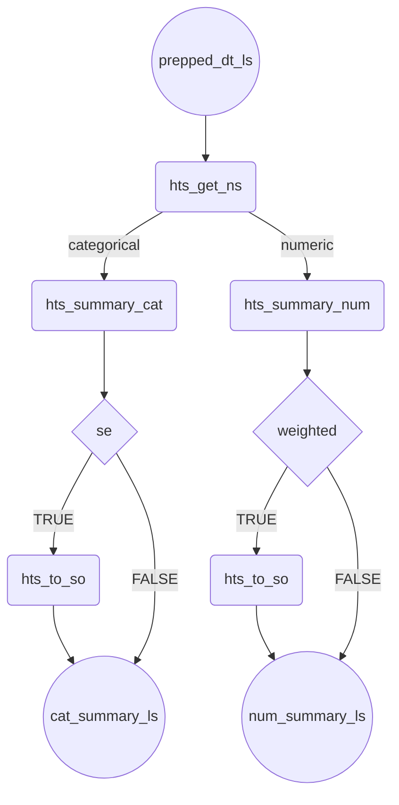

  <!-- badges: start -->
  
  
  
  <!-- badges: end -->

## Travel Survey Tools
`travelSurveyTools` is an R package that empowers users of household travel survey (HTS) data to create meaningful summaries of their data. Currently, `travelSurveyTools` is compatible with HTS datasets from [RSG, Inc.](https://rsginc.com/), but we hope to expand to any travel survey. If you would like to collaborate, please contact Erika Redding at [erika.redding@rsginc.com](mailto:erika.redding@rsginc.com?subject=TravelSurveyTools). These datasets usually contain six tables: household, person, day, trip, vehicle, and location. In the future, we may expand `travelSurveyTools` to work with other types of travel survey data or other types of surveys.

`travelSurveyTools` is in active development and is open-source; anyone can contribute 🤝. See the [CONTRIBUTING](CONTRIBUTING.md) page to learn how.

### Cloning instructions

1. Set config - 
`usethis::use_git_config(user.name = {"username"}, user.email = {your_email@email.com})`

2. Go to github page to generate token - 
`usethis::create_github_token()`

3. Paste your PAT into pop-up that follows - 
`credentials::set_github_pat()`

4. Lastly, `remotes::install_github()` will work - 
`remotes::install_github('RSGInc/travelSurveyTools')`

### What can this package do?

Some of the things this package enables include:

* Cross tabs with an unlimited number of variables 
* Summarizes numeric, categorical, date, and date-time variables
* Accepts both weighted and unweighted data
* Numeric summaries return means, medians, and summaries with binned data
* Ability to use customized datasets (e.g., filtered, binned, renamed data)
* Data labeling helper functions
* Returns sample sizes/unweighted counts
* Standard errors calculated with survey statistics
* Ability to specify custom weights
* Trip rate calculations

## Creating the prepared data list

## Creating the summary

